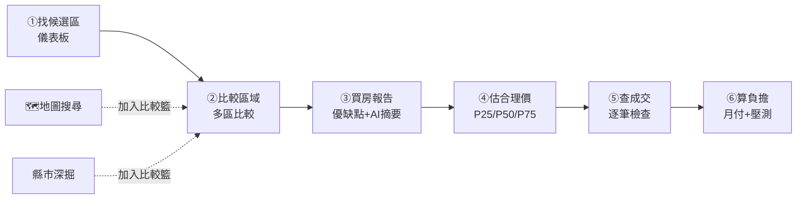
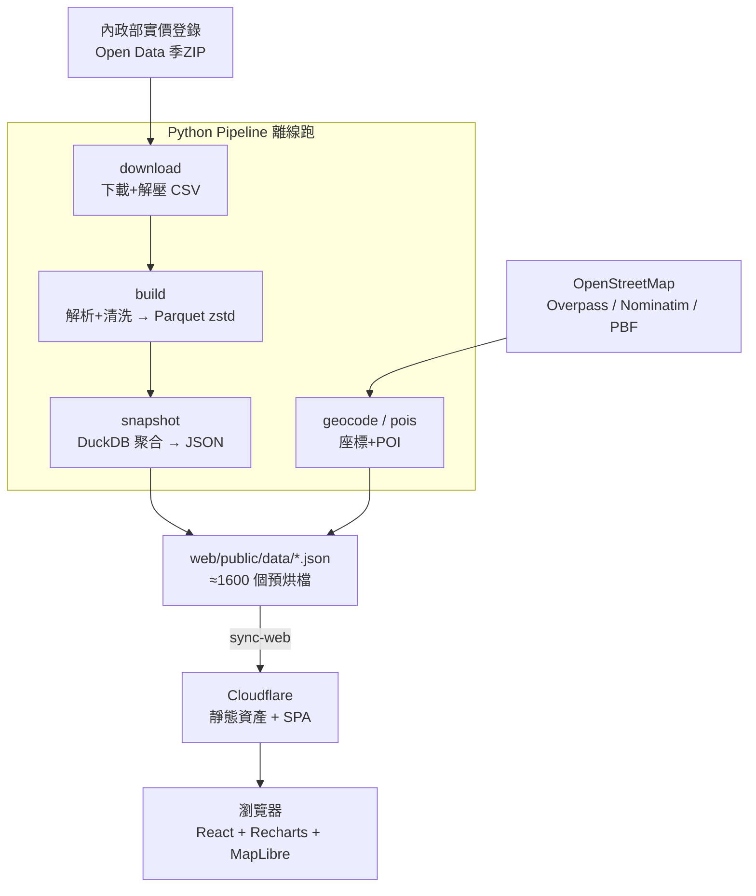

# Realprice — fast edition

> **全台 22 縣市實價登錄，做成「買房決策工具」。**
> 資料來自內政部實價登錄 Open Data，採「**預烘靜態 JSON + CDN 直送**」架構：
> 無後端、無資料庫、無 cold start，查詢以 CDN 邊緣速度回應。

`React + Vite + Tailwind`（前端）｜`Python + DuckDB + Parquet`（資料管線）｜`Cloudflare`（部署）

---

## 這是什麼

市面上的實價登錄網站多半停在「**查價**」。這個站想再往前一步，回答買方真正在問的問題：

> 「我這筆預算，**在哪一區**、**買多大**、**出多少**才合理？**這個價位到底貴不貴？**」

所以它不只是把成交資料畫成圖表，而是把資料串成一條**買房決策動線**：
從「找候選區 → 比較 → 估合理價 → 查個案 → 算月付」，每一步都有對應的工具頁面。

它是 [Have-House](../Have-House/)（PostgreSQL on NAS 的舊站）的姊妹站，**完全獨立、零耦合**，
資料同源但架構完全不同 —— 詳見最後[「為什麼這樣比較快」](#為什麼這樣比-v1-nas-postgres-快)。

---

## 🧭 網站能做什麼（功能總覽）

16 個頁面，同時服務**買方、賣方/業務、投資（收租）**三種角色：

| # | 頁面 | 路徑 | 一句話 | 核心問題 |
|---|------|------|--------|----------|
| 1 | **首頁總覽** | `/` | 全台 22 縣市的中位均價排行、總覽數據表 | 全台行情長什麼樣？ |
| 2 | **買房儀表板** | `/dashboard` | 輸入預算/坪數/房型，自動排出「可優先看屋」的行政區，給保守/合理/警戒出價帶 | 我的預算該往哪幾區看？ |
| 3 | **地圖搜尋** | `/map` | 互動地圖：鄉鎮泡泡 ↔ 路段點、路名/門牌搜尋、POI 圖層、預算地圖 | 這一帶實際多少錢？周邊機能如何？ |
| 4 | **縣市深掘** | `/region` | 單一縣市的鄉鎮排行、月度趨勢、動能、屋齡/坪數/型態交叉、價位分位 | 這個縣市內部怎麼挑區？ |
| 5 | **估價工具** | `/estimate` | 輸入地區+類型+坪數，回推 P25/P50/P75 合理價區間 | 這個價位合理嗎？該出多少？ |
| 6 | **賣房估價** 🆕 | `/sell` | 反推合理成交價＋建議開價（含樓層溢價、議價空間），並列同區成交佐證 | 我的房子值多少？該開多少？ |
| 7 | **社區同棟** 🆕 | `/community` | 把成交依門牌聚成「棟」，看同棟成交、樓層溢價、屋齡與走勢 | 這一棟到底成交多少？某戶開價貴不貴？ |
| 8 | **撿漏雷達** | `/underpriced` | 列出成交單價低於同區同類 P25 的 85% 以下的物件 | 哪裡有成交偏低、值得追蹤的案子？ |
| 9 | **租金投報** 🆕 | `/yield` | join 同區租賃×買賣成交，算年化毛投報率，全台＋鄉鎮排行 | 買來收租划算嗎？哪一區回報高？ |
| 10 | **多區比較** | `/compare` | 同時並排 2–5 個鄉鎮的中位價、成交量、動能、月度走勢 | 我猶豫的兩三區到底差多少？ |
| 11 | **買房報告** | `/report` | 把「比較籃」整理成優勢/風險報告，並產出可交給 LLM 的結構化摘要 | 幫我把這幾區的結論整理好 |
| 12 | **成交瀏覽** | `/browse` | 每縣市每類別最新 2000 筆明細，含個案檢查卡、同路段歷史 | 我想看原始成交、逐筆檢查 |
| 13 | **購屋試算** | `/calc` | 房貸月付、可負擔房價、升息壓力測試 | 月付多少？我買得起嗎？升息會怎樣？ |
| 14 | **交易成本** 🆕 | `/cost` | 買方(契稅/代書/設定/仲介/火險)＋賣方(仲介/土增/房地合一2.0)雙模式總計 | 房價以外還要準備多少？賣掉淨拿回多少？ |
| 15 | **關於與方法** | `/about` | 設計初衷、架構、資料品質規則、免責 | 這些數字怎麼來的？可信嗎？ |
| 16 | **業務模式** 🆕 | `/broker` | 開價/成交/議價空間/在架量/月供應量（去化速度）聚成業務儀表板；給屋主/買方委託簡報的 LLM 契約一鍵輸出（台南深耕） | 這區好不好賣？該怎麼跟屋主/買方談？ |

三類交易全程支援：**買賣 `sale` ／ 預售 `presale` ／ 租賃 `rent`**。

> 🆕 標記為新增的四頁（賣房估價 / 社區同棟 / 租金投報 / 交易成本）**全部純前端計算、沿用既有預烘 JSON，不需新增資料檔或重跑 pipeline**。

### 設計成一條決策動線

每個工具頁上方都有一條「買房流程」導引列（[`WorkflowSteps`](web/src/components/WorkflowSteps.tsx)），
用一個共享的「**比較籃 / shortlist**」把各頁串起來 —— 在地圖或儀表板看到喜歡的區「加入比較籃」，
就能直接帶到比較頁、報告頁：



---

## 📄 頁面逐一詳解

### 1. 首頁總覽 `/`
全台 22 縣市一眼看完：中位單價排行條形圖（深→淺代表高→低）、四個全景 KPI（總成交、全台中位均價、最高/最低均價縣市），以及逐縣市數據表，可一鍵「深掘 →」跳到該縣市。買賣/預售/租賃切換。

### 2. 買房儀表板 `/dashboard`　⭐ 核心
輸入 **縣市 + 預算 + 室內坪數 + 建物型態**，系統為每個行政區算一個 **0–100 決策分數**，綜合：
- **可負擔性** —— 用同條件估價樣本（或鄉鎮中位）× 坪數估算總價 ÷ 預算
- **成交流動性** —— 近 12 月成交量
- **價格動能** —— 近 6 月 vs 前 6 月（過熱會扣分）
- **樣本可信度** —— 同條件估價樣本數

輸出：可負擔行政區數、低風險候選數、**首選區域**，並對首選區給出**保守開價 / 合理成交 / 偏貴警戒**三檔出價區間，可一鍵帶總價去 `/calc` 試算。每區附風險等級（低/中/高）與白話建議（「優先看屋，可保守開價」…）。

### 3. 地圖搜尋 `/map`　🗺
基於 **MapLibre GL** 的互動地圖：

- **雙層級顯示**：縮放 < 13 級顯示「**鄉鎮泡泡**」（數字＝中位單價），≥ 13 級切換到「**路段點**」。泡泡顏色由 cyan→amber→red 代表價格低→高。
- **政府全國圖資疊加**（即時介接、不入庫、全台 22 縣市）：
  - **底圖切換**：街道（OSM）／電子地圖／**航照影像**（內政部國土測繪中心 NLSC WMTS）。
  - **疊圖**（可開關＋透明度）：**土地使用**（國土利用現況）、**地質敏感區**（活動斷層／山崩地滑／地下水補注）、**地籍圖**（宗地界）。
  - **風險圖層**：🟥 **土壤液化潛勢**、**活動斷層**（經濟部地質調查所 WMS；高/中/低潛勢分區），開啟時附「潛勢概估、僅供參考」免責。
- **路名 / 門牌搜尋**：輸入「中華路」找路段、輸入「中華路100號」優先比對門牌級成交，選取即 fly-to 定位。
- **POI 圖層**：可疊加 🚇 車站、🎓 學校、⚠ 嫌惡設施（懶載入）。
- **預算地圖**：拉預算與目標坪數滑桿，即時標出哪些行政區「在預算內」（綠）/「超出」（黃）。
- **點選詳情**：點泡泡看該區成交、生活機能摘要、近期成交清單（可跳到地圖點位）；點路段看同路段 + 800m 內鄰近成交，並可一鍵開 **Google 街景看現場**。
- **可分享視角**：縣市/類別/選取點寫進 URL hash，複製連結即可分享當前地圖狀態；支援瀏覽器上一頁/下一頁。
- 基於資料保護，**不還原個別物件完整門牌**。

### 4. 縣市深掘 `/region`
單一縣市的完整剖面：鄉鎮排行表（點選看月度趨勢）、**自住友善候選區**卡片（價格/成交量/動能綜合排序 + 風險提醒）、區域**敘事摘要**（headline + 可信度 + 優勢/風險條列）、月度中位＋成交量複合圖、價格動能、**建物型態比較**（公寓/華廈/大樓/透天 誰 CP 高）、**屋齡對價格的影響**、**坪數對應總價**、**價位分位**（P10–P90 + 直方圖）。URL 帶 `?county=&dk=&district=` 可深連結。

### 5. 估價工具 `/estimate`
輸入 **縣市 + 鄉鎮 + 建物型態 + 坪數（+ 屋齡參考）**，從近 24 個月相似物件成交回推 **P25 / P50 / P75 合理價區間**，附視覺化區間條與買方策略（保守開價 = P25、合理成交 = P50、偏貴警戒 = P75）。找不到完全符合的足量樣本時，自動退階到「同區同型態」→「同區」加權估算，並標示資料來源與信心提醒。

### 6. 賣房估價 `/sell`　🏷 賣方
站在**屋主／賣方業務**角度，是估價工具的反向版：輸入縣市+鄉鎮+型態+坪數+樓層，複用 `estimator/{cc}` 的 P25/P50/P75 算出**合理成交價**，再依你想預留的**議價空間**（預設 6%）回推**建議開價（牌價）**。提供**樓層溢價調整**（高樓 +、低樓 −，市場慣例粗估，可關閉），並列出同區（可再用路名關鍵字篩同路段）近期成交，每筆標「vs 你的合理價」貴/便宜幾 %，談價時直接拿來佐證。

### 7. 社區同棟 `/community`　🏢
鄉鎮、路段看完，買賣決策最後一哩是「**這一棟**」。把最新 2000 筆成交**依門牌號聚成「棟」**（至少 3 筆才列出），可依鄉鎮 + 路名/門牌關鍵字搜尋。展開任一棟看：同棟成交筆數、中位單價、屋齡中位、**高樓層 vs 低樓層的樓層溢價 %**、同棟中位單價的月度走勢，以及逐筆成交（樓層/坪數/格局/單價/總價/屋齡）。純前端聚合，基於資料保護不還原完整門牌與戶別。

### 8. 撿漏雷達 `/underpriced`　🎯
列出近 6 個月成交中，單價**低於同區同類別 P25 的 85% 以下**的物件，按折扣大→小排序。附「最大折扣 / 平均折扣 / 總撿到便宜」KPI。明確提醒：**便宜不一定好**（可能屋況差、頂加、違建、漏水），並已排除特殊註記交易。

### 9. 租金投報 `/yield`　💰 投資
把**同一地區的租賃成交與買賣成交 join 起來**算 **年化毛投報率 = 年租金 ÷ 房價**（rent heatmap 的 月租/坪 × 12 ÷ sale heatmap 的 單價/坪，坪數約分掉）。提供全台 22 縣市投報排行（橫條圖，可點選切換）＋選定縣市的鄉鎮排行表（含收租優/尚可/偏低/極低評級）。這是市面其他實價站少見的視角 —— 因為要同時握有租、售兩邊成交。明確標示為**毛投報**（未扣管理費/稅/空置/利息），並提醒高投報常伴隨增值性偏弱。

### 10. 多區比較 `/compare`
同時並排 **2–5 個鄉鎮**的中位價/均價/總價/成交量/近半年動能，加上 60 個月的月度走勢折線比較。自動給「比較結論」：哪區**預算友善**、哪區**流動性最高**、哪區**最穩**、哪區**短期最強**，並彙整買房提醒。可直接從「比較籃」帶入，並一鍵「產生買房報告」。

### 11. 買房報告 `/report`
把比較籃的行政區整理成一份決策報告：每區 headline、行情指標、優勢/風險條列，並依成交量/價格/動能/風險算分排序。最關鍵的是底部產出 **AI-ready 結構化摘要**——
一份只含「已驗證證據」的 JSON，外加一份完整的 **LLM API 契約**（messages + `json_schema` response format，見 [`llmContract.ts`](web/src/lib/llmContract.ts)），一鍵複製即可丟給 GPT/Claude 生成自然語言報告，且約束模型「只能用提供的證據、不得杜撰行情」。

### 12. 成交瀏覽 `/browse`
每縣市每類別預烘的**最新 2000 筆**明細：可依鄉鎮/地址關鍵字篩選、依成交日/單價/總價排序、可選擇是否顯示特殊註記交易（凶宅/急售/親友…會標 ⚠）。展開任一筆可看：
- **個案檢查卡**：該成交相對「同路段中位」「目前篩選中位」貴/便宜多少 %，附看屋提醒（屋齡偏高、低樓層、坪數過小…）。
- **同路段近 36 月歷史成交**：交叉比對是否買貴。
- **匯出 CSV**：一鍵把目前篩選結果匯出（含 UTF-8 BOM，Excel 直接開不亂碼）。

### 13. 購屋試算 `/calc`　🧮
三個工具，全部在瀏覽器端計算（不送伺服器）：
1. **房貸試算** —— 總價/自備款比例/利率/年期 → 月付、總利息，附逐年本金/利息/剩餘本金圖。
2. **可負擔房價** —— 月收入/DTI/自備款 → 回推可負擔總價，並用縣市中位換算「大約能買幾坪」。
3. **升息壓力測試** —— 從目前利率起跳，逐級加碼看月付與總利息怎麼變。

預設利率 2.225%（央行公股水準）。可從儀表板用 `?price=&county=` 帶入估算總價。

### 14. 交易成本 `/cost`　🧾
房價以外的「隱形成本」一次算清，**買方／賣方雙模式**，純前端計算：
- **買方**：契稅（房屋評定現值 × 6%，以佔成交價比例估）、印花稅、登記規費、代書費、抵押權設定規費、銀行開辦/鑑估費、履約保證費、仲介費、火險地震險 → **開頭要準備的現金合計**（自備款 + 雜費）。
- **賣方**：仲介費、土地增值稅（概估）、**房地合一稅 2.0**（依持有年數 45/35/20/15%，自住優惠 400 萬免稅、超過 10%）、代書 → **賣掉後實際淨拿回**（已扣成本與房貸餘額）。

稅率邏輯在 [`calc.ts`](web/src/lib/calc.ts) 的 `consolidatedTax()`，皆為概算，正式金額以稅單與地政士為準。可從儀表板/試算帶入 `?price=`。

### 15. 關於與方法 `/about`
設計初衷、Pipeline / Web 架構、資料品質排除規則、法律免責。

---

## 🏗 技術架構

核心理念：**把「會被反覆讀取的聚合」一次烘成靜態 JSON，從 CDN 邊緣直送瀏覽器。**
前端沒有任何 API server——所有資料都是 `fetch('/data/*.json')`（見 [`data.ts`](web/src/lib/data.ts)）。



**前端技術棧**
- **React 18 + Vite 5 + TypeScript** —— 路由用 `react-router-dom`，頁面全部 `lazy()` 分包
- **Tailwind CSS** —— 自訂「編輯部 / 研究機構」主題（serif 標題、tabular mono 數字、低彩度）
- **Recharts** —— 圖表；**MapLibre GL** —— 地圖
- **無狀態管理庫**：資料層用一個帶記憶體快取的 `fetchJSON`，比較籃用 localStorage（[`shortlist.ts`](web/src/lib/shortlist.ts)）

**資料管線技術棧**
- **httpx** 抓 MOI ZIP；**pyarrow** 寫 Parquet（zstd）；**DuckDB** 跑聚合 SQL；**loguru** log
- 地理：OSM **Overpass**（POI）、**Nominatim**（路段/地址 geocode，1 req/s）、**Taiwan PBF**（本地門牌庫，門牌級定位）

---

## 🛠 資料管線（pipeline）

```powershell
cd realprice-fast\pipeline
python -m pip install -r requirements.txt

# 從 ROC 113 (2024) 起到最新季：下載 + 烘 Parquet + 烘 JSON + 同步到 web
$env:PYTHONPATH = "src"
python -m realprice all --since 113
```

> 也可用根目錄的一鍵腳本：`.\run-pipeline.ps1 -Since 113`（加 `-Insecure` 略過 TLS 驗證）。
>
> ⚠️ 內政部主機憑證偶爾老舊，SSL 驗證失敗時設 `$env:REALPRICE_INSECURE_TLS = "1"`。
> **僅對這個 public open-data 端點建議使用**，勿套用到其他 host。

### 子指令

| 指令 | 用途 |
|---|---|
| `python -m realprice download --since 113` | 只下載 ZIP + 解壓，不解析 |
| `python -m realprice build --since 113` | 解析 CSV + 清洗 → 寫 Parquet |
| `python -m realprice snapshot` | 從 Parquet 重新烘所有聚合 JSON |
| `python -m realprice sync-web` | 把 snapshots 複製到 `web/public/data/` |
| `python -m realprice all --since 113` | build + snapshot + sync-web |
| `python -m realprice latest` | 抓當期旬報 + 重新 build/snapshot/sync（每旬更新用） |
| `python -m realprice ... --season 114S2` | 改成只處理單一季 |
| `python -m realprice pois` | 從 OSM Overpass 抓全台 POI（車站/學校/嫌惡設施）|
| `python -m realprice geocode --top-per-county 100` | 把各縣市熱門路段轉座標寫入 cache（Nominatim）|
| `python -m realprice addr-geocode --apply-after` | 逐筆地址 geocode → 門牌級座標套回 `recent/*.json` |
| `python -m realprice osm-build` | 從 Taiwan PBF 建本地門牌庫（一次性，5M+ 筆，~10 分鐘）|
| `python -m realprice osm-apply` | 用本地門牌庫 + cache 把座標套到 `recent/*.json`（不查 Nominatim）|

> 最後一步永遠是把 `snapshots/` 複製到 `web/public/data/`，前端直接同源讀。

### 預烘出來的 JSON（前端的全部「資料庫」）

| 目錄 / 檔 | 內容 | 顆粒度 | 檔數 |
|---|---|---|---|
| `meta.json` | 縣市/鄉鎮/型態/最新成交日 索引 | 全站 | 1 |
| `county-summary.json` | 22 縣市總覽（三類別） | 全站 | 1 |
| `heatmap/{cc}-{dk}` | 鄉鎮中位/均價/成交量 | 縣市×類別 | 66 |
| `momentum/{cc}-{dk}` | 近 6 月 vs 前 6 月動能 | 縣市×類別 | 66 |
| `distribution/{cc}-{dk}` | 價位分位 P10–P90 + 直方圖 | 縣市×類別 | 66 |
| `recent/{cc}-{dk}` | 最新 2000 筆明細（含特殊註記）| 縣市×類別 | 66 |
| `building-type/{cc}-{dk}` | 公寓/華廈/大樓/透天 比較 | 縣市×類別 | 66 |
| `roads/{cc}-{dk}` | 路段聚合 + lat/lng | 縣市×類別 | 66 |
| `district-monthly/{cc}-{district}-{dk}` | 鄉鎮月度趨勢 | 縣市×鄉鎮×類別 | ~1089 |
| `age-buckets/{cc}` · `size-buckets/{cc}` | 屋齡 / 坪數分箱（買賣）| 縣市 | 各 22 |
| `estimator/{cc}` | 鄉鎮×型態×坪數分箱 的 P25/P50/P75 | 縣市 | 22 |
| `underpriced/{cc}` | 撿漏清單（低於同區 P25 85%）| 縣市 | 22 |
| `road-history/{cc}` | 同路段近 36 月歷史成交 | 縣市 | 22 |
| `poi/{stations,schools,nimby}` | 全台 POI 點位 | 全站 | 3 |

---

## 🚀 本機開發

```powershell
# 1. 取得專案
git clone https://github.com/legstrong77-maker/realprice-fast.git
cd realprice-fast

# 2. 跑前端（資料已預烘在 web/public/data/，純展示不需要 Python）
cd web
npm install
npm run dev          # 開 http://localhost:5173
```

> 前端的展示資料（`web/public/data/`）已隨 git 版控，**clone 下來直接 `npm run dev` 就能跑**，
> 不必先跑 Python 管線。只有要「更新到最新一季資料」時才需要 pipeline。

要重新烘資料，再照上面[資料管線](#-資料管線pipeline)跑一次即可。

> **門牌級地址搜尋**用到的本地 OSM 庫（`data/osm/`，PBF ~309 MB + SQLite ~819 MB）太大未入庫；
> 需要時用 `python -m realprice osm-build` 重建（會提示先 `curl` 抓 Taiwan PBF）。日常展示用不到。

---

## ☁️ 部署（Cloudflare）

根目錄 [`wrangler.jsonc`](wrangler.jsonc) 把 `web/dist` 當靜態資產、以 SPA 模式服務：

```powershell
cd web
npm run build        # → web/dist/（已含 public/data 的 JSON）
cd ..
npx wrangler deploy  # 用 wrangler.jsonc 上 Cloudflare
```

預期速度：首頁、縣市頁、瀏覽頁皆 < 100 ms（CDN edge）。
資料更大時可選：把 `web/public/data/` 上 **R2**，前端設 `VITE_DATA_BASE` 指向 R2 自訂網域，`dist/` 上 Pages。

---

## 🧹 資料品質規則

聚合統計一律排除以下單筆，避免被汙染：
- 備註含 `親友 / 員工 / 債務 / 瑕疵 / 凶宅 / 受贈 / 急售 / 急讓 / 受迫 / 特殊`
- 單價/坪 < 1,000 元 或 > 5,000,000 元
- 建物面積 < 20 平方公尺（疑似車位）
- 租賃用獨立規則：總價在 1,000 ~ 2,000,000 元

特殊交易仍會保留在 `recent/*.json`（瀏覽頁可選擇顯示），但**所有統計類聚合一律排除**。

---

## 🗺 涵蓋範圍

全台 **22 縣市**、三類交易（買賣/預售/租賃）：

- **六都**：臺北 `a`、新北 `f`、桃園 `h`、臺中 `b`、臺南 `d`、高雄 `e`
- **省轄市**：基隆 `c`、新竹市 `o`、嘉義市 `i`
- **縣**：宜蘭 `g`、新竹縣 `j`、苗栗 `k`、南投 `m`、彰化 `n`、雲林 `p`、嘉義縣 `q`、屏東 `t`、花蓮 `u`、臺東 `v`
- **外島**：金門 `w`、澎湖 `x`、連江 `z`

---

## 📁 專案結構

```
realprice-fast/
├── pipeline/                  ← Python：MOI → Parquet → JSON 預烘
│   ├── src/realprice/
│   │   ├── download.py        季ZIP 下載/解壓
│   │   ├── parse.py / build.py 解析清洗 → Parquet
│   │   ├── snapshot.py        DuckDB 聚合 → JSON（核心）
│   │   ├── geocode.py         路段 → 座標（Nominatim）
│   │   ├── addr_geocode.py    逐筆地址 → 門牌級座標
│   │   ├── osm_addr.py        Taiwan PBF → 本地門牌 SQLite
│   │   ├── pois.py            Overpass → 車站/學校/嫌惡設施
│   │   └── config.py          縣市碼、類別、品質規則
│   └── requirements.txt
├── web/                       ← React + Vite + Tailwind
│   ├── src/
│   │   ├── pages/             16 個頁面（買方/賣方/業務/投資）
│   │   ├── components/        KpiBar / Section / DealKindTabs / WorkflowSteps
│   │   ├── lib/               data(資料契約) / analysis / calc / shortlist / llmContract / format
│   │   └── App.tsx            報頭 + 導覽 + 路由
│   └── public/data/           ← 預烘 JSON（已版控，前端直接 fetch）
├── wrangler.jsonc             ← Cloudflare 部署設定
└── run-pipeline.ps1           ← 一鍵更新腳本
```

---

## 為什麼這樣比 v1 (NAS Postgres) 快

| 維度 | Have-House (NAS) | realprice-fast |
|---|---|---|
| 儲存 | HDD + Postgres 索引 | Parquet（zstd）+ CDN/R2 |
| 查詢 | 即時 SQL，每請求打 NAS | 預烘 JSON，從 CDN 邊緣讀 |
| 伺服器 | 1 GB RAM / DB shared_buffers | **無伺服器** |
| Cold start | warmup + TTL cache，第一請求可能慢 | 不存在 cold start |
| 對外延遲 | NAS → Cloudflare Tunnel → 邊緣 | 資料就在 CF 邊緣節點 |
| 月費 | NAS 電 + 網 | < $1（存儲 + 流量）|

代價：個人化的「全表 ad-hoc 查詢」要走 v1 或之後加 DuckDB-WASM；pipeline 需排程觸發（每旬一次）。

---

## 路線圖

- [x] 預烘 JSON 架構（六都 → **全台 22 縣市**）
- [x] 地圖（MapLibre + 鄉鎮泡泡/路段點 + POI + 預算地圖）
- [x] 估價工具（P25/P50/P75 合理價區間）
- [x] 撿漏雷達（低於同區 P25 的成交）
- [x] 購屋試算（房貸 / 可負擔 / 升息壓測）
- [x] 買房儀表板 + 多區比較 + 比較籃串接
- [x] 門牌級地址搜尋（OSM 本地庫 + Nominatim cache）
- [x] 買房報告 + LLM API 契約輸出
- [x] 賣方視角：賣房估價（建議開價）+ 交易成本（含房地合一稅 2.0）
- [x] 投資視角：租金投報率（租賃×買賣 join）
- [x] 社區同棟頁（依門牌聚合，樓層溢價）
- [x] 地圖整合政府全國圖資（NLSC 航照/土地使用/地質敏感/地籍）+ 風險圖層（土壤液化/活動斷層）+ Google 街景 + 成交 CSV 匯出
- [x] 開價端供給分析：asking 歷史累積（時間序列地基）、待售量/在架量（台南真實抓取）、開價vs成交月線（領先vs落後指標疊圖）、月供應量（去化速度）、業務模式 /broker（委託簡報 LLM 契約輸出）
- [ ] 淹水潛勢圖層（NCDR 限政府單位申請，待取得介接）
- [ ] 都市計畫使用分區（NLSC 開放 WMTS 無內容，待改接國土署/縣市來源）
- [ ] 接 LLM 後端，把結構化摘要變成自然語言報告
- [ ] DuckDB-WASM：瀏覽頁支援任意過濾 / 客端 SQL
- [ ] GitHub Actions 自動排程跑 pipeline + push

---

## 與 Have-House (v1) 的關係

完全獨立、零耦合。v1 的 NAS Postgres 不需要動，本站不會碰它；可同時跑兩個做 A/B 比較，也可隨時砍掉任一個。

## 法律

本站所有統計**僅供參考，不構成購屋、投資、金融或不動產顧問建議**。
成交資料著作權屬內政部，請遵守該網站開放資料使用條款。地圖疊加之政府圖資版權分屬
**內政部國土測繪中心（NLSC）**（航照／電子地圖／土地使用／地質敏感／地籍）與
**經濟部地質調查及礦業管理中心**（土壤液化潛勢／活動斷層，屬潛勢概估非保證）。
任何決策前請諮詢專業仲介、估價師或代書，並以各主管機關正式資料為準。
