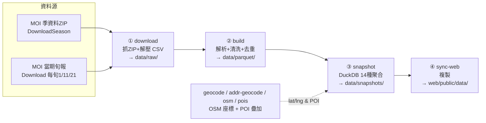

# Pipeline — realprice-fast 資料管線

> **內政部實價登錄 CSV → 清洗標準化 → Parquet → DuckDB 預烘 → 靜態 JSON。**
> 純離線批次，沒有常駐服務。產出複製到 [`web/public/data/`](../web/public/data/)，前端直接 fetch。
>
> 前端功能、部署請看 [上層 README](../README.md)。本檔只講「資料怎麼來、怎麼被清乾淨、怎麼烘成 JSON」。

`Python 3` ｜ `httpx`（抓檔）｜ `pandas`（解析）｜ `pyarrow`（Parquet/zstd）｜ `duckdb`（聚合）｜ `loguru`（log）

---

## 快速跑通

```powershell
cd realprice-fast\pipeline
python -m pip install -r requirements.txt

# 從 ROC 113 (2024) 起到最新季：下載 + 烘 Parquet + 烘 JSON + 同步到 web
$env:PYTHONPATH = "src"
python -m realprice all --since 113
```

> 或用根目錄一鍵腳本：`.\run-pipeline.ps1 -Since 113`（加 `-Insecure` 略過 TLS 驗證）。
>
> ⚠️ 內政部 `plvr.land.moi.gov.tw` 的 SSL 憑證偶爾老舊（Missing Subject Key Identifier 之類），
> 驗證失敗時設 `$env:REALPRICE_INSECURE_TLS = "1"` 讓 httpx 跳過驗證。
> 公開資料、非機密，但仍是**顯式 opt-in**，請勿套用到其他 host。

---

## 四個階段



| 階段 | 指令 | 輸入 → 輸出 |
|---|---|---|
| ① 下載 | `download` | MOI 端點 → `data/raw/lvr_*.zip` + 解壓 CSV |
| ② 建表 | `build` | raw CSV → `data/parquet/{dk}-{cc}.parquet`（zstd）|
| ③ 預烘 | `snapshot` | Parquet → `data/snapshots/**/*.json`（14 類）|
| ④ 同步 | `sync-web` | snapshots → `web/public/data/`（前端讀這裡）|
| 全部 | `all` | ②+③+④（`latest` 再加抓當期旬報）|

---

## ② build：解析 + 清洗 + 去重

### 來源檔名規則
解壓後找 `{縣市碼}_lvr_land_{a|b|c}.csv`，其餘忽略：

| 後綴 | 交易類別 | `deal_kind` |
|---|---|---|
| `a` | 不動產買賣 | `sale` |
| `b` | 預售屋買賣 | `presale` |
| `c` | 不動產租賃 | `rent` |

### 標準化（[`parse.py`](src/realprice/parse.py)）
MOI 原始 CSV 很髒，逐筆做了這些事：

- **民國年日期** → 西元 `date`（`1130520` → 2024-05-20）；拒收明顯錯誤的未來日期。
- **中文/全形樓層** → 整數（`地下一層` → `-1`、`十二層` → `12`）。
- **路段擷取** `extract_road()`：用 regex 從門牌抽出 `區+路+段`（`臺北市信義區基隆路一段３號` → `信義區基隆路一段`），純土地/地號回 `None`。這欄是地圖路段聚合與 geocode 的 key。
- **屋齡** = 交易日 − 建築完成年月（年，1 位小數）。
- **單價/坪** = 單價/平方公尺 × `3.305785`。
- **特殊交易旗標** `is_special_deal`：備註含 `親友/員工/債務/瑕疵/凶宅/受贈/急售/急讓/受迫/特殊` 任一即為 `True`。
- 同時兼容買賣/預售/租賃三套**中英文欄名變體**（租賃用「租賃層次」「總額元」等不同欄名）。

### 寫 Parquet（[`build.py`](src/realprice/build.py)）
- 切檔佈局：`{deal_kind}-{county}.parquet`，例 `sale-a.parquet`（臺北買賣）、`rent-e.parquet`（高雄租賃）。最多 22 縣市 × 3 類別 = 66 檔（依實際有資料者）。
- **跨季去重**：同 `(serial_no, deal_kind)` 只留 `source_season` 最新一筆 —— 因為旬報會涵蓋季資料、季與季之間也會重疊。
- 32 欄統一 schema（serial_no、county_code、district、address、road、building_area_sqm、age_years、rooms/halls/baths、total_price、unit_price_per_ping、deal_date、is_special_deal、note…），zstd 壓縮。

---

## ③ snapshot：14 種預烘聚合（[`snapshot.py`](src/realprice/snapshot.py)）

DuckDB 直接 `read_parquet()` 建 view，跑 SQL 聚合後寫成 JSON。NaN/Inf 一律清成 `null`（避免 JS 解析炸）。

| 產出 | 內容 | 時間窗 | 關鍵過濾 |
|---|---|---|---|
| `meta.json` | 縣市/鄉鎮/型態/最新成交日 索引 | — | — |
| `county-summary.json` | 22 縣市總覽（三類別）| 全部 | clean |
| `heatmap/{cc}-{dk}` | 鄉鎮中位/均價/成交量 | 近 12 月 | clean |
| `momentum/{cc}-{dk}` | 近 6 月 vs 前 6 月中位動能 | 12 月切兩半 | clean |
| `district-monthly/{cc}-{district}-{dk}` | 鄉鎮月度趨勢 | 近 60 月 | clean |
| `distribution/{cc}-{dk}` | 單價分位 P10–P90 + 10萬/格直方圖 | 近 12 月 | clean |
| `building-type/{cc}-{dk}` | 公寓/華廈/大樓/透天 比較 | 近 12 月 | clean, `≥5` 筆 |
| `age-buckets/{cc}` | 屋齡分箱 × 中位單價（買賣）| 近 12 月 | clean |
| `size-buckets/{cc}` | 坪數分箱 × 中位總價（買賣）| 近 12 月 | clean |
| `roads/{cc}-{dk}` | 路段聚合 + `lat/lng` | 近 24 月 | clean, `≥3` 筆, 上限 800 |
| `recent/{cc}-{dk}` | 最新 2000 筆明細 | 全部 | **寬鬆**（含特殊註記）|
| `estimator/{cc}` | 鄉鎮×型態×坪數分箱 的 P25/P50/P75 | 近 24 月 | clean, `≥5` 筆 |
| `underpriced/{cc}` | 撿漏：單價 ≤ 同區同類 P25×0.85 | 近 6 月 | clean, 群組 `≥10` 筆 |
| `road-history/{cc}` | 同路段近 36 月所有成交 | 近 36 月 | clean, 每路段 ≤200 |

**兩套品質過濾**：
```sql
-- WHERE_CLEAN（買賣/預售，所有統計類）
is_special_deal = FALSE
AND unit_price_per_ping BETWEEN 1000 AND 5000000
AND building_area_sqm >= 20            -- 排除疑似車位

-- WHERE_RENT（租賃）
is_special_deal = FALSE
AND total_price BETWEEN 1000 AND 2000000
```
> 例外：`recent/*.json` 用寬鬆條件、**保留**特殊交易，由前端切換顯示，讓買家自行判斷要不要參考凶宅/急售等資料。

最後 `sync-web` 把整個 `snapshots/` 砍掉重建到 `web/public/data/`。

---

## 🌏 地理編碼與 POI（地圖頁用）

地圖功能需要把「路段 / 門牌」轉成座標，並疊加生活機能點位。這幾步是**獨立、可選**的疊加層：

| 模組 | 指令 | 作用 | 產物 |
|---|---|---|---|
| [`geocode.py`](src/realprice/geocode.py) | `geocode` | 各縣市熱門**路段** → 座標（OSM Nominatim, 1 req/s）| `data/geocode_cache.json`（key `cc\|road`）|
| [`addr_geocode.py`](src/realprice/addr_geocode.py) | `addr-geocode` | 逐筆**門牌**地址 → 座標，套回 `recent/*.json` 的 `lat/lng` | `data/addr_geocode_cache.json` |
| [`osm_addr.py`](src/realprice/osm_addr.py) | `osm-build` / `osm-apply` | 從 Taiwan PBF 建**本地門牌庫**（5M+ 節點 SQLite），離線批次補門牌座標、命中率高又不打 Nominatim | `data/osm/`（PBF + SQLite）|
| [`pois.py`](src/realprice/pois.py) | `pois` | OSM Overpass 抓全台 **POI** | `snapshots/poi/{stations,schools,nimby}.json` |

- `roads/*.json` 在 snapshot 時就會把 `geocode_cache.json` 的 `lat/lng` 併進去；沒命中的路段前端會 fallback 到區中心。
- `data/geocode_cache.json`、`data/addr_geocode_cache.json` **有入庫**（重建很慢，每旬增量）；`data/osm/`（~1.1 GB）**未入庫**，需要時重建。

```powershell
# 一次性：抓 Taiwan PBF 後建本地門牌庫
curl -sSL --create-dirs -o data/osm/taiwan-latest.osm.pbf https://download.geofabrik.de/asia/taiwan-latest.osm.pbf
python -m realprice osm-build
python -m realprice osm-apply            # 把門牌座標套到 recent/*.json
python -m realprice pois                 # 抓 POI
```

---

## CLI 完整參考

```text
download       下載 MOI ZIP（不解析）         --since 113 | --season 113S4
build          解析 + 寫 Parquet              --since 113 | --season
snapshot       從 Parquet 產出聚合 JSON
sync-web       snapshots → web/public/data
all            build + snapshot + sync-web    --since 113 | --season
latest         抓當期旬報 + 重新 all（每旬更新用）
pois           OSM Overpass 抓全台 POI
geocode        路段 → 座標（Nominatim）       --top-per-county 100 --max-count N
addr-geocode   逐筆地址 → 門牌座標            --counties g,j,m --only-road-cached
                                              --apply-after | --apply-only | --upgrade-osm
osm-build      Taiwan PBF → 本地門牌 SQLite（先 curl PBF）
osm-apply      本地門牌庫 + cache 套到 recent/*.json   [--no-osm]
```

---

## 路徑與環境變數

| 變數 / 路徑 | 預設 | 說明 |
|---|---|---|
| `PYTHONPATH` | — | 跑前需設 `src`（src layout，免安裝套件）|
| `REALPRICE_DATA_DIR` | `<repo>/data` | 資料根目錄 |
| `REALPRICE_INSECURE_TLS` | 關 | `=1` 時 httpx 跳過 MOI 憑證驗證 |
| `data/raw/` | | 下載的 ZIP + 解壓 CSV（gitignored）|
| `data/parquet/` | | 欄式儲存（gitignored，重建成本低）|
| `data/snapshots/` | | 預烘 JSON（gitignored）|
| `data/*geocode_cache.json` | | 座標 cache（**入庫**，重建慢）|
| `data/osm/` | | PBF + 門牌 SQLite（**未入庫**，~1.1 GB）|
| `web/public/data/` | | sync 目標，前端 fetch 來源（**入庫**）|

---

## 更新節奏

- **季資料**（`DownloadSeason`）：每季結束後約 6 週公告。`latest_season()` 會保守抓「上一季」確保抓得到。
- **當期旬報**（`Download`）：每月 1 / 11 / 21 滾動更新，含尚未併入季檔的最新成交。`build` / `latest` 預設會一起抓並去重。
- 日常維護：每旬跑一次 `python -m realprice latest`，再 `cd ../web; npm run build` 重新部署即可。
